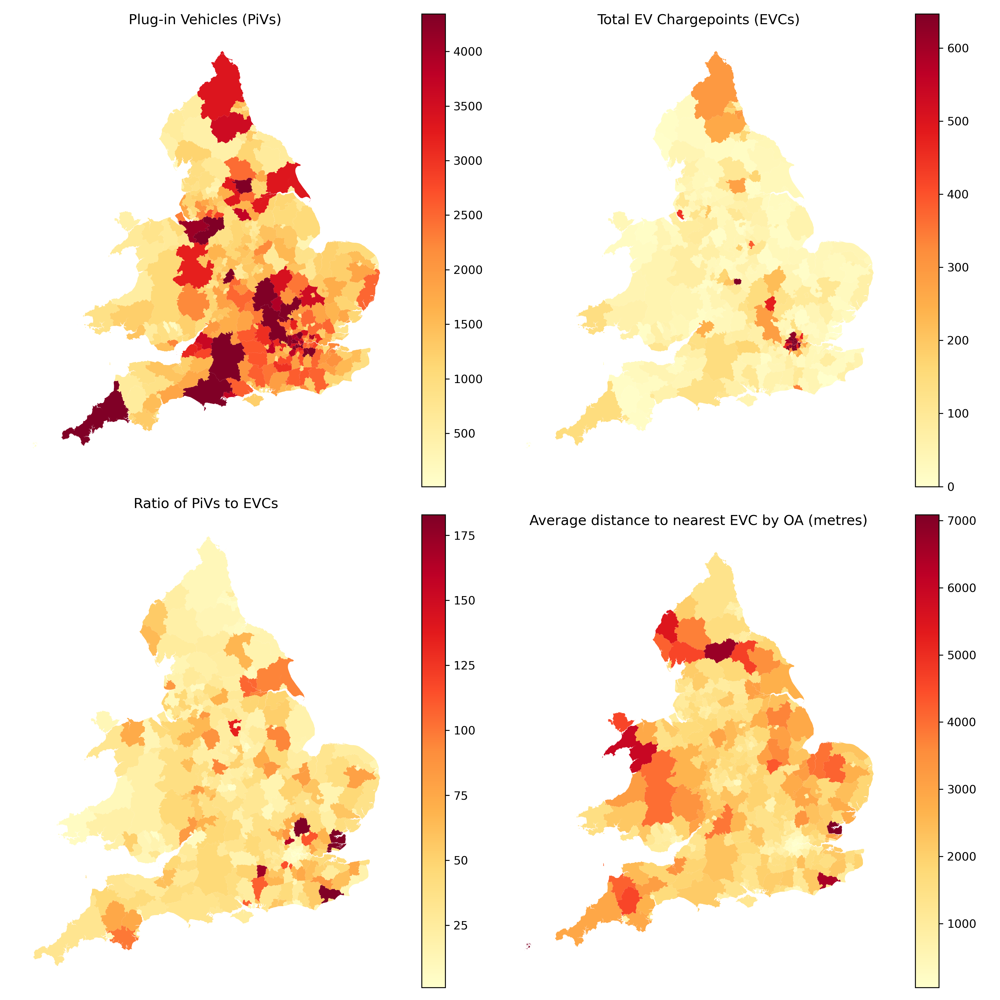
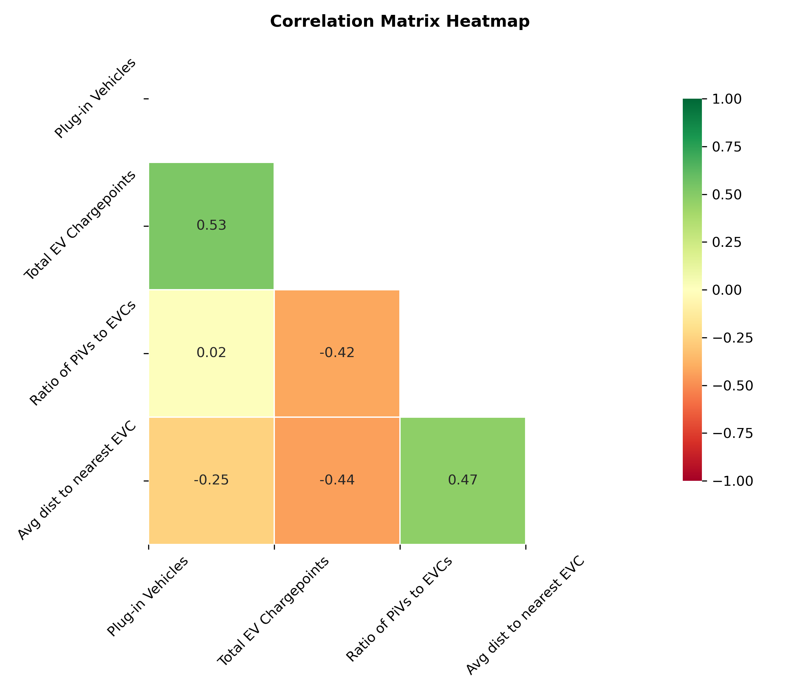
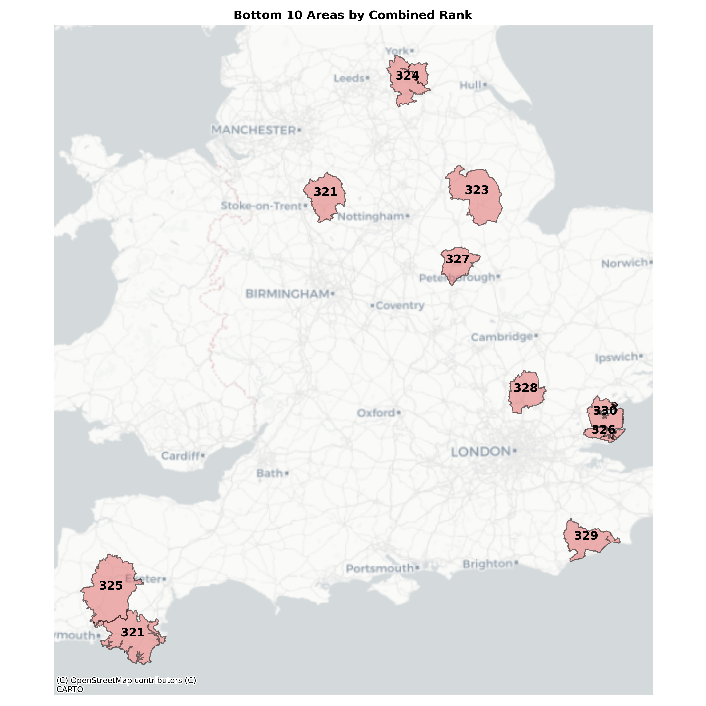

## Summary

This analysis uses public EV chargepoint and plug-in vehicle (PiV) registration data to understand, by local authority district (LAD), which areas have the best and worst EV infrastructure.

### What data is included?

First, four features are calculated to allow for initial exploration of the data. Details of these are as follows:

**Count of PiVs**

*Source: DVLA and DfT dataset*

* A simple count of registered PiVs by LAD is calculated.
* This includes all PiVs with `Private` keepership. This excludes PiVs where the keepership is `Company` to avoid skewing the analysis with large quantities of fleet vehicles registered to a single address.
* Where data has been suppressed in the raw file, the `[c]` value has been replaced with `NaN`

**Count of EV chargepoints**

*Source: Public EV chargepoint registry*

* A simple count of public EV chargepoints by LAD is calculated.
* There has been no cleaning of this data beyond converting the `latitude` and `longitude` into a `point`. This is a public dataset and further accuracy has not been verified.

**Ratio of PiVs to EV chargepoints**

*Source: Author's calculations*

* Taking the count of PiVs in each LAD and dividing this by the count of public EV chargepoints in each LAD.
* A higher ratio means there are more PiVs to each chargepoint and therefore public infrastructure may be lacking.

**Average distance to nearest EV chargepoint**

*Source: Geographies from ONS via Open Geography Portal*

* Using the population-weighted centroids (PWCs) for each output area (OA) within an LAD, the nearest public EV chargepoint is calculated. OA is the smallest census geography and contains between 40 and 250 households.
* Then this is aggregated to LAD level by taking the average distance of all OAs within the LAD to obtain the average distance to the nearest public EV chargepoint by LAD.


### What do these features show?

The following choropleths map these four features. The absolute number of PiVs varies across England and Wales, with LADs across Wales, Lincolnshire and Cumbria having particularly low numbers. By contrast, the highest number of public EV chargepoints by LAD is concentrated in Greater London, with hotspots dotted elsewhere across the country. If we instead look at this as the ratio of PiVs to chargepoints, we again see the patterns change. Hotspots around the southeast of England highlight that there is potentially infrastructure lacking in these areas compared to PiV numbers. Lastly, we can see the average distance to the nearest chargepoint is perhaps unsurprisingly highest in rural areas, particularly in the north of England and Wales.



*Code to create an interactive version of this map can be found below.*


### What is the relationship between the features?

The correlation matrix heatmap below shows the relationship between each feature. There is some positive correlation between chargepoints and PiVs, which is good as this suggests that where there are more PiVs there tend to be more chargepoints. There is also some positive correlation between average distance to the nearest chargepoint and the ratio of PiVs to chargepoints. This means that if the distance is greater, there are also more PiVs to chargepoints perhaps suggesting these areas lack infrastructure.



The following scatter plots illustrate this further, adding a regression line. We can see that there are outliers across both, with a cluster of LADs on the lower end.


### So what does this mean for public EV infrastructure?

Taking the ratio of PiVs to public EV chargepoints and the average distance to the nearest chargepoint, a simple ranking is created combining the two. Areas with a high ratio of PiVs to chargepoints and a large distance to the nearest chargepoint could be lacking in public EV infrastructure.

**Top 10**
The best performing LADs were all in London, suggesting infrastructure in the capital is well established.


<table border="1" class="dataframe">
  <thead>
    <tr style="text-align: right;">
      <th></th>
      <th>LAD22CD</th>
      <th>LAD22NM</th>
      <th>combined_rank</th>
    </tr>
  </thead>
  <tbody>
    <tr>
      <th>288</th>
      <td>E09000013</td>
      <td>Hammersmith and Fulham</td>
      <td>1.0</td>
    </tr>
    <tr>
      <th>308</th>
      <td>E09000033</td>
      <td>Westminster</td>
      <td>2.0</td>
    </tr>
    <tr>
      <th>303</th>
      <td>E09000028</td>
      <td>Southwark</td>
      <td>3.0</td>
    </tr>
    <tr>
      <th>276</th>
      <td>E09000001</td>
      <td>City of London</td>
      <td>4.0</td>
    </tr>
    <tr>
      <th>295</th>
      <td>E09000020</td>
      <td>Kensington and Chelsea</td>
      <td>4.0</td>
    </tr>
    <tr>
      <th>299</th>
      <td>E09000024</td>
      <td>Merton</td>
      <td>6.0</td>
    </tr>
    <tr>
      <th>307</th>
      <td>E09000032</td>
      <td>Wandsworth</td>
      <td>6.0</td>
    </tr>
    <tr>
      <th>282</th>
      <td>E09000007</td>
      <td>Camden</td>
      <td>8.0</td>
    </tr>
    <tr>
      <th>287</th>
      <td>E09000012</td>
      <td>Hackney</td>
      <td>9.0</td>
    </tr>
    <tr>
      <th>294</th>
      <td>E09000019</td>
      <td>Islington</td>
      <td>9.0</td>
    </tr>
  </tbody>
</table>


**Bottom 10**
The worst performing LADs are more dispersed. Most are more rural areas, or include only one or two larger towns.



<style scoped>
    .dataframe tbody tr th:only-of-type {
        vertical-align: middle;
    }

    .dataframe tbody tr th {
        vertical-align: top;
    }

    .dataframe thead th {
        text-align: right;
    }
</style>
<table border="1" class="dataframe">
  <thead>
    <tr style="text-align: right;">
      <th></th>
      <th>LAD22CD</th>
      <th>LAD22NM</th>
      <th>combined_rank</th>
    </tr>
  </thead>
  <tbody>
    <tr>
      <th>99</th>
      <td>E07000074</td>
      <td>Maldon</td>
      <td>330.0</td>
    </tr>
    <tr>
      <th>89</th>
      <td>E07000064</td>
      <td>Rother</td>
      <td>329.0</td>
    </tr>
    <tr>
      <th>235</th>
      <td>E07000242</td>
      <td>East Hertfordshire</td>
      <td>328.0</td>
    </tr>
    <tr>
      <th>16</th>
      <td>E06000017</td>
      <td>Rutland</td>
      <td>327.0</td>
    </tr>
    <tr>
      <th>100</th>
      <td>E07000075</td>
      <td>Rochford</td>
      <td>326.0</td>
    </tr>
    <tr>
      <th>85</th>
      <td>E07000047</td>
      <td>West Devon</td>
      <td>325.0</td>
    </tr>
    <tr>
      <th>177</th>
      <td>E07000169</td>
      <td>Selby</td>
      <td>324.0</td>
    </tr>
    <tr>
      <th>160</th>
      <td>E07000139</td>
      <td>North Kesteven</td>
      <td>323.0</td>
    </tr>
    <tr>
      <th>82</th>
      <td>E07000044</td>
      <td>South Hams</td>
      <td>321.0</td>
    </tr>
    <tr>
      <th>199</th>
      <td>E07000198</td>
      <td>Staffordshire Moorlands</td>
      <td>321.0</td>
    </tr>
  </tbody>
</table>


This information could be used by both public and private organisations alike to understand where public EV infrastructure is lacking and therefore incentivise installation of new infrastructure.


### Considerations and future work

This analysis has demonstrated that current public EV structure may be lacking in some areas based on the current number of PiVs. This does not include:

* A temporal view of how PiV ownership has changed over time - there may be areas experiencing higher growth, with could arguably justify increased investment over other areas.
* EV infrastructure on private property (e.g. at home) - areas with a higher number of terraced houses or flats may require more public infrastructure as it can often be more challenging to install at these types of properties. Areas with higher rates of rented accomodation over private ownership could also face challenges as it would be the responsibility of the landlord to install EV chargepoints. Again, these areas may require more public infrastructure and so overlaying this data could be an interesting investigation to see how it affects the ranking.

The public EV chargepoint registry has also not been quality checked. Further investigation into this dataset and wrangling/cleaning as appropriate may impact results.

## Coding

## Import libraries


```python
import pandas as pd
import geopandas as gpd
from shapely.geometry import Point
import numpy as np
import seaborn as sns
from scipy.stats import zscore
import matplotlib.pyplot as plt
import contextily as ctx
import folium
```

## Data wrangling

### EV Chargepoint data

* **Public EV chargepoint registry**, available from: [https://www.gov.uk/guidance/find-and-use-data-on-public-electric-vehicle-chargepoints](https://www.gov.uk/guidance/find-and-use-data-on-public-electric-vehicle-chargepoints)


```python
# Import csv
chargepoints_RAW = pd.read_csv('Data/national-charge-point-registry_230524.csv', low_memory=False)
```


```python
# Reduce to just required columns
chargepoints_TRIM = chargepoints_RAW[['chargeDeviceID','reference','name','latitude','longitude']]
```


```python
# Check length of df
len(chargepoints_TRIM)
```


40580


```python
# Visual check
chargepoints_TRIM.head()
```


<style scoped>
    .dataframe tbody tr th:only-of-type {
        vertical-align: middle;
    }

    .dataframe tbody tr th {
        vertical-align: top;
    }

    .dataframe thead th {
        text-align: right;
    }
</style>
<table border="1" class="dataframe">
  <thead>
    <tr style="text-align: right;">
      <th></th>
      <th>chargeDeviceID</th>
      <th>reference</th>
      <th>name</th>
      <th>latitude</th>
      <th>longitude</th>
    </tr>
  </thead>
  <tbody>
    <tr>
      <th>0</th>
      <td>b86a77a42bb68c81946ec50cfc95e89d</td>
      <td>11172306P</td>
      <td>Network Rail Westwood Centre 1</td>
      <td>52.386590</td>
      <td>-1.587384</td>
    </tr>
    <tr>
      <th>1</th>
      <td>dc1c347d471f68e41ad2a9a1145941d6</td>
      <td>APT-0296-0015/13P</td>
      <td>Brindley Drive Car Park Birmingham - 70524</td>
      <td>52.480918</td>
      <td>-1.907710</td>
    </tr>
    <tr>
      <th>2</th>
      <td>7d545ad9367ccb8a80c94a953314ae71</td>
      <td>CM123</td>
      <td>Renault Liverpool</td>
      <td>53.383579</td>
      <td>-2.977230</td>
    </tr>
    <tr>
      <th>3</th>
      <td>68c7fca1e3bba5e49ec90847dcdd456b</td>
      <td>CM164</td>
      <td>NCP Portman Square</td>
      <td>51.516201</td>
      <td>-0.157996</td>
    </tr>
    <tr>
      <th>4</th>
      <td>ac7a21c48f5833b33a5b606b2089e6a9</td>
      <td>CM167</td>
      <td>NCP Prince Street Car Park</td>
      <td>51.450340</td>
      <td>-2.596704</td>
    </tr>
  </tbody>
</table>


```python
# Geocode locations using lat and long, set crs to 4326 and then convert to 27700 (British National Grid), drop lat and long
chargepoints_gdf = gpd.GeoDataFrame(chargepoints_TRIM,
                                    geometry=gpd.points_from_xy(chargepoints_TRIM.longitude, chargepoints_TRIM.latitude)
                                   ).set_crs(epsg=4326, inplace=True).to_crs(epsg=27700).drop(columns=['latitude','longitude'])
```


```python
# Visual check
chargepoints_gdf.head()
```


<style scoped>
    .dataframe tbody tr th:only-of-type {
        vertical-align: middle;
    }

    .dataframe tbody tr th {
        vertical-align: top;
    }

    .dataframe thead th {
        text-align: right;
    }
</style>
<table border="1" class="dataframe">
  <thead>
    <tr style="text-align: right;">
      <th></th>
      <th>chargeDeviceID</th>
      <th>reference</th>
      <th>name</th>
      <th>geometry</th>
    </tr>
  </thead>
  <tbody>
    <tr>
      <th>0</th>
      <td>b86a77a42bb68c81946ec50cfc95e89d</td>
      <td>11172306P</td>
      <td>Network Rail Westwood Centre 1</td>
      <td>POINT (428179.411 276586.797)</td>
    </tr>
    <tr>
      <th>1</th>
      <td>dc1c347d471f68e41ad2a9a1145941d6</td>
      <td>APT-0296-0015/13P</td>
      <td>Brindley Drive Car Park Birmingham - 70524</td>
      <td>POINT (406364.849 287003.294)</td>
    </tr>
    <tr>
      <th>2</th>
      <td>7d545ad9367ccb8a80c94a953314ae71</td>
      <td>CM123</td>
      <td>Renault Liverpool</td>
      <td>POINT (335096.815 387859.900)</td>
    </tr>
    <tr>
      <th>3</th>
      <td>68c7fca1e3bba5e49ec90847dcdd456b</td>
      <td>CM164</td>
      <td>NCP Portman Square</td>
      <td>POINT (527908.652 181305.630)</td>
    </tr>
    <tr>
      <th>4</th>
      <td>ac7a21c48f5833b33a5b606b2089e6a9</td>
      <td>CM167</td>
      <td>NCP Prince Street Car Park</td>
      <td>POINT (358631.700 172541.813)</td>
    </tr>
  </tbody>
</table>


### EV Cars data

* **df_VEH0145**: Licensed plug-in vehicles (PiVs) at the end of the quarter by fuel type and lower super output area (LSOA): United Kingdom, available from: [https://www.gov.uk/government/statistical-data-sets/vehicle-licensing-statistics-data-files](https://www.gov.uk/government/statistical-data-sets/vehicle-licensing-statistics-data-files)


```python
# Import csv
PiVs_RAW = pd.read_csv('Data/df_VEH0145.csv', low_memory=False)
```


```python
# Reduce to just required columns
PiVs_TRIM = PiVs_RAW[['LSOA11CD','LSOA11NM','Fuel','Keepership','2023 Q4']]
```


```python
# Visual check
PiVs_TRIM.head()
```


<style scoped>
    .dataframe tbody tr th:only-of-type {
        vertical-align: middle;
    }

    .dataframe tbody tr th {
        vertical-align: top;
    }

    .dataframe thead th {
        text-align: right;
    }
</style>
<table border="1" class="dataframe">
  <thead>
    <tr style="text-align: right;">
      <th></th>
      <th>LSOA11CD</th>
      <th>LSOA11NM</th>
      <th>Fuel</th>
      <th>Keepership</th>
      <th>2023 Q4</th>
    </tr>
  </thead>
  <tbody>
    <tr>
      <th>0</th>
      <td>95AA01S1</td>
      <td>Aldergrove 1</td>
      <td>Battery electric</td>
      <td>Company</td>
      <td>[c]</td>
    </tr>
    <tr>
      <th>1</th>
      <td>95AA01S2</td>
      <td>Aldergrove 2</td>
      <td>Battery electric</td>
      <td>Company</td>
      <td>9</td>
    </tr>
    <tr>
      <th>2</th>
      <td>95AA01S3</td>
      <td>Aldergrove 3</td>
      <td>Battery electric</td>
      <td>Company</td>
      <td>[c]</td>
    </tr>
    <tr>
      <th>3</th>
      <td>95AA02W1</td>
      <td>Balloo</td>
      <td>Battery electric</td>
      <td>Company</td>
      <td>5</td>
    </tr>
    <tr>
      <th>4</th>
      <td>95AA03W1</td>
      <td>Ballycraigy</td>
      <td>Battery electric</td>
      <td>Company</td>
      <td>[c]</td>
    </tr>
  </tbody>
</table>


```python
# Filter to all Fuel and private Keepership types, then drop those columns
PiVs_FILTERED = PiVs_TRIM[(PiVs_TRIM['Fuel'] == 'Total') & 
                          (PiVs_TRIM['Keepership'] == 'Private')].drop(columns=['Fuel', 'Keepership'])
```


```python
# Replace the suppressed [c] data with NaN
PiVs_FILTERED['2023 Q4'] = PiVs_FILTERED['2023 Q4'].replace('[c]', np.nan)

# Convert the '2023 Q4' column to numeric data type
PiVs_FILTERED['2023 Q4'] = pd.to_numeric(PiVs_FILTERED['2023 Q4'])
```


```python
# Visual check
PiVs_FILTERED.head()
```


<style scoped>
    .dataframe tbody tr th:only-of-type {
        vertical-align: middle;
    }

    .dataframe tbody tr th {
        vertical-align: top;
    }

    .dataframe thead th {
        text-align: right;
    }
</style>
<table border="1" class="dataframe">
  <thead>
    <tr style="text-align: right;">
      <th></th>
      <th>LSOA11CD</th>
      <th>LSOA11NM</th>
      <th>2023 Q4</th>
    </tr>
  </thead>
  <tbody>
    <tr>
      <th>189862</th>
      <td>95AA01S1</td>
      <td>Aldergrove 1</td>
      <td>NaN</td>
    </tr>
    <tr>
      <th>189863</th>
      <td>95AA01S2</td>
      <td>Aldergrove 2</td>
      <td>15.0</td>
    </tr>
    <tr>
      <th>189864</th>
      <td>95AA01S3</td>
      <td>Aldergrove 3</td>
      <td>19.0</td>
    </tr>
    <tr>
      <th>189865</th>
      <td>95AA02W1</td>
      <td>Balloo</td>
      <td>10.0</td>
    </tr>
    <tr>
      <th>189866</th>
      <td>95AA03W1</td>
      <td>Ballycraigy</td>
      <td>NaN</td>
    </tr>
  </tbody>
</table>


#### LSOA lookup

The PiV data uses the LSOA codes from 2011 and so this will need to be changed to the LSOA 2021 codes.

* **LSOA best fit lookup 2011 to 2021**, available from: [https://geoportal.statistics.gov.uk/datasets/b14d449ba10a48508bd05cd4a9775e2b_0/explore](https://geoportal.statistics.gov.uk/datasets/b14d449ba10a48508bd05cd4a9775e2b_0/explore)


```python
# Import csv
LSOA_lookup = pd.read_csv(
    'Data/LSOA_(2011)_to_LSOA_(2021)_to_Local_Authority_District_(2022)_Best_Fit_Lookup_for_EW_(V2).csv',
    low_memory=False)
```


```python
# Reduce to just required columns
LSOA_lookup = LSOA_lookup[['LSOA11CD','LSOA21CD','LAD22CD','LAD22NM']].copy()
```


```python
# Match 2021 to 2011 codes using lookup
PiVs_FILTERED = pd.merge(PiVs_FILTERED, LSOA_lookup, on='LSOA11CD')
```


```python
# Visual check
PiVs_FILTERED.head()
```


<style scoped>
    .dataframe tbody tr th:only-of-type {
        vertical-align: middle;
    }

    .dataframe tbody tr th {
        vertical-align: top;
    }

    .dataframe thead th {
        text-align: right;
    }
</style>
<table border="1" class="dataframe">
  <thead>
    <tr style="text-align: right;">
      <th></th>
      <th>LSOA11CD</th>
      <th>LSOA11NM</th>
      <th>2023 Q4</th>
      <th>LSOA21CD</th>
      <th>LAD22CD</th>
      <th>LAD22NM</th>
    </tr>
  </thead>
  <tbody>
    <tr>
      <th>0</th>
      <td>E01000001</td>
      <td>City of London 001A</td>
      <td>28.0</td>
      <td>E01000001</td>
      <td>E09000001</td>
      <td>City of London</td>
    </tr>
    <tr>
      <th>1</th>
      <td>E01000002</td>
      <td>City of London 001B</td>
      <td>30.0</td>
      <td>E01000002</td>
      <td>E09000001</td>
      <td>City of London</td>
    </tr>
    <tr>
      <th>2</th>
      <td>E01000003</td>
      <td>City of London 001C</td>
      <td>15.0</td>
      <td>E01000003</td>
      <td>E09000001</td>
      <td>City of London</td>
    </tr>
    <tr>
      <th>3</th>
      <td>E01000005</td>
      <td>City of London 001E</td>
      <td>NaN</td>
      <td>E01000005</td>
      <td>E09000001</td>
      <td>City of London</td>
    </tr>
    <tr>
      <th>4</th>
      <td>E01000006</td>
      <td>Barking and Dagenham 016A</td>
      <td>18.0</td>
      <td>E01000006</td>
      <td>E09000002</td>
      <td>Barking and Dagenham</td>
    </tr>
  </tbody>
</table>


### LADs

* **LADs 2021 polygons**, available from: [https://geoportal.statistics.gov.uk/datasets/305779d69bf44feea05eeaa78ca26b5f_0/explore](https://geoportal.statistics.gov.uk/datasets/305779d69bf44feea05eeaa78ca26b5f_0/explore)


```python
# Import shp file
LADs = gpd.read_file('Data/Local_Authority_Districts_December_2022_UK_BFC_V2_-177113771882051469/LAD_DEC_2022_UK_BFC_V2.shp')
```


```python
# Reduce to just required columns
LADs = LADs[['LAD22CD','LAD22NM','geometry']].copy()
```


```python
# Visual check
LADs.head()
```


<style scoped>
    .dataframe tbody tr th:only-of-type {
        vertical-align: middle;
    }

    .dataframe tbody tr th {
        vertical-align: top;
    }

    .dataframe thead th {
        text-align: right;
    }
</style>
<table border="1" class="dataframe">
  <thead>
    <tr style="text-align: right;">
      <th></th>
      <th>LAD22CD</th>
      <th>LAD22NM</th>
      <th>geometry</th>
    </tr>
  </thead>
  <tbody>
    <tr>
      <th>0</th>
      <td>E06000001</td>
      <td>Hartlepool</td>
      <td>MULTIPOLYGON (((450154.599 525938.201, 450140....</td>
    </tr>
    <tr>
      <th>1</th>
      <td>E06000002</td>
      <td>Middlesbrough</td>
      <td>MULTIPOLYGON (((446854.700 517192.700, 446854....</td>
    </tr>
    <tr>
      <th>2</th>
      <td>E06000003</td>
      <td>Redcar and Cleveland</td>
      <td>MULTIPOLYGON (((451747.397 520561.100, 451792....</td>
    </tr>
    <tr>
      <th>3</th>
      <td>E06000004</td>
      <td>Stockton-on-Tees</td>
      <td>MULTIPOLYGON (((447177.704 517811.797, 447176....</td>
    </tr>
    <tr>
      <th>4</th>
      <td>E06000005</td>
      <td>Darlington</td>
      <td>POLYGON ((423496.602 524724.299, 423497.204 52...</td>
    </tr>
  </tbody>
</table>


```python
len(LADs)
```


374


### OAs

This analysis will use the population-weighted centroids (PWCs) to find the nearest EV chargepoints. This will then be aggregated to LAD level, so the OA to LAD lookup is required.

* **OA 2021 PWCs**, available from: [https://geoportal.statistics.gov.uk/datasets/b9b2b2440af240ce9d30a1d39a7507c2_0/explore](https://geoportal.statistics.gov.uk/datasets/b9b2b2440af240ce9d30a1d39a7507c2_0/explore)
* **OA to LAD lookup**, available from: [https://geoportal.statistics.gov.uk/datasets/b9ca90c10aaa4b8d9791e9859a38ca67_0/explore](https://geoportal.statistics.gov.uk/datasets/b9ca90c10aaa4b8d9791e9859a38ca67_0/explore)

#### OA PWCs


```python
# Import shp file
OA_PWC = gpd.read_file('Data/Output_Areas_2021_PWC_V3_-1981902074309169314/PopCentroids_EW_2021_V3.shp')
```


```python
# Reduce to just required columns
OA_PWC = OA_PWC[['OA21CD','geometry']].copy()
```

#### OA to LAD lookup


```python
# Import csv
OA_lookup = pd.read_csv(
    'Data/Output_Area_to_Lower_layer_Super_Output_Area_to_Middle_layer_Super_Output_Area_to_Local_Authority_District_(December_2021)_Lookup_in_England_and_Wales_v3.csv',
    low_memory=False)
```


```python
# Keep only required columns
OA_lookup = OA_lookup[['OA21CD','LSOA21CD','LAD22CD']].copy()
```


```python
# Visual check
OA_lookup.head()
```


<style scoped>
    .dataframe tbody tr th:only-of-type {
        vertical-align: middle;
    }

    .dataframe tbody tr th {
        vertical-align: top;
    }

    .dataframe thead th {
        text-align: right;
    }
</style>
<table border="1" class="dataframe">
  <thead>
    <tr style="text-align: right;">
      <th></th>
      <th>OA21CD</th>
      <th>LSOA21CD</th>
      <th>LAD22CD</th>
    </tr>
  </thead>
  <tbody>
    <tr>
      <th>0</th>
      <td>E00060358</td>
      <td>E01011968</td>
      <td>E06000001</td>
    </tr>
    <tr>
      <th>1</th>
      <td>E00060359</td>
      <td>E01011968</td>
      <td>E06000001</td>
    </tr>
    <tr>
      <th>2</th>
      <td>E00060360</td>
      <td>E01011968</td>
      <td>E06000001</td>
    </tr>
    <tr>
      <th>3</th>
      <td>E00060361</td>
      <td>E01011968</td>
      <td>E06000001</td>
    </tr>
    <tr>
      <th>4</th>
      <td>E00060362</td>
      <td>E01011970</td>
      <td>E06000001</td>
    </tr>
  </tbody>
</table>


## Feature engineering

### Aggregate EV car ownership data to LAD


```python
# Aggregate to LAD and calculate total number of PiVs
PiVs_LAD = PiVs_FILTERED.groupby('LAD22CD')['2023 Q4'].agg('sum').reset_index()

# Rename column to PiVs
PiVs_LAD.rename(columns={'2023 Q4': 'PiVs'}, inplace=True)
```


```python
# Visual check
PiVs_LAD.head()
```


<style scoped>
    .dataframe tbody tr th:only-of-type {
        vertical-align: middle;
    }

    .dataframe tbody tr th {
        vertical-align: top;
    }

    .dataframe thead th {
        text-align: right;
    }
</style>
<table border="1" class="dataframe">
  <thead>
    <tr style="text-align: right;">
      <th></th>
      <th>LAD22CD</th>
      <th>PiVs</th>
    </tr>
  </thead>
  <tbody>
    <tr>
      <th>0</th>
      <td>E06000001</td>
      <td>410.0</td>
    </tr>
    <tr>
      <th>1</th>
      <td>E06000002</td>
      <td>391.0</td>
    </tr>
    <tr>
      <th>2</th>
      <td>E06000003</td>
      <td>580.0</td>
    </tr>
    <tr>
      <th>3</th>
      <td>E06000004</td>
      <td>1308.0</td>
    </tr>
    <tr>
      <th>4</th>
      <td>E06000005</td>
      <td>719.0</td>
    </tr>
  </tbody>
</table>


```python
len(PiVs_LAD)
```


331


### Calculate distance to nearest chargepoint

* Using the OA PWCs, calculate the nearest EV chargepoint.
* Aggregate this to LAD level to get the average distance to the nearest chargepoint by LAD.


```python
# Find the nearest chargepoint to each OA PWC and calculate distance in metres
OA_nearest_chargepoint = OA_PWC.sjoin_nearest(chargepoints_gdf, distance_col='distance', how='left')
```


```python
# Merge on OA_lookup_Leeds to get the LAD22CDs
OA_nearest_chargepoint = pd.merge(OA_nearest_chargepoint, OA_lookup, on='OA21CD', how='inner')
```


```python
# Keep only required columns
OA_nearest_chargepoint = OA_nearest_chargepoint[['OA21CD','geometry','distance','LAD22CD']].copy()
```


```python
# Aggregate to LAD and calculate average distance to nearest chargepoint
avg_dist_nearest_chargepoint_LAD = OA_nearest_chargepoint.groupby('LAD22CD')['distance'].agg('mean').reset_index()

# Rename column to avg_distance
avg_dist_nearest_chargepoint_LAD.rename(columns={'distance': 'avg_distance'}, inplace=True)
```


```python
# Visual check
avg_dist_nearest_chargepoint_LAD.head()
```


<style scoped>
    .dataframe tbody tr th:only-of-type {
        vertical-align: middle;
    }

    .dataframe tbody tr th {
        vertical-align: top;
    }

    .dataframe thead th {
        text-align: right;
    }
</style>
<table border="1" class="dataframe">
  <thead>
    <tr style="text-align: right;">
      <th></th>
      <th>LAD22CD</th>
      <th>avg_distance</th>
    </tr>
  </thead>
  <tbody>
    <tr>
      <th>0</th>
      <td>E06000001</td>
      <td>1649.498055</td>
    </tr>
    <tr>
      <th>1</th>
      <td>E06000002</td>
      <td>1088.305461</td>
    </tr>
    <tr>
      <th>2</th>
      <td>E06000003</td>
      <td>1454.585351</td>
    </tr>
    <tr>
      <th>3</th>
      <td>E06000004</td>
      <td>911.259807</td>
    </tr>
    <tr>
      <th>4</th>
      <td>E06000005</td>
      <td>1188.923394</td>
    </tr>
  </tbody>
</table>


```python
len(avg_dist_nearest_chargepoint_LAD)
```


331


### Calculate number of EV chargepoints in each LAD

* Aggregate the EV chargepoint data to LAD level to get total number of chargepoints in each LAD.


```python
# Spatially match
chargepoints_LAD = gpd.sjoin(LADs, chargepoints_gdf, predicate='intersects')
```


```python
# Aggregate to LAD and calculate total number of chargepoints
chargepoints_LAD = chargepoints_LAD.groupby('LAD22CD')['index_right'].agg('count').reset_index()

# Rename column to total_chargepoints
chargepoints_LAD.rename(columns={'index_right': 'total_chargepoints'}, inplace=True)
```


```python
# Visual check
chargepoints_LAD.head()
```


<style scoped>
    .dataframe tbody tr th:only-of-type {
        vertical-align: middle;
    }

    .dataframe tbody tr th {
        vertical-align: top;
    }

    .dataframe thead th {
        text-align: right;
    }
</style>
<table border="1" class="dataframe">
  <thead>
    <tr style="text-align: right;">
      <th></th>
      <th>LAD22CD</th>
      <th>total_chargepoints</th>
    </tr>
  </thead>
  <tbody>
    <tr>
      <th>0</th>
      <td>E06000001</td>
      <td>42</td>
    </tr>
    <tr>
      <th>1</th>
      <td>E06000002</td>
      <td>51</td>
    </tr>
    <tr>
      <th>2</th>
      <td>E06000003</td>
      <td>46</td>
    </tr>
    <tr>
      <th>3</th>
      <td>E06000004</td>
      <td>167</td>
    </tr>
    <tr>
      <th>4</th>
      <td>E06000005</td>
      <td>76</td>
    </tr>
  </tbody>
</table>


```python
len(chargepoints_LAD)
```


373


### Calculate ratio of EV cars to chargepoints in each LAD


```python
# Merge PiVs and chargepoint count dataframes
ratio_PiVs_to_chargepoints = pd.merge(PiVs_LAD, chargepoints_LAD, on='LAD22CD', how='left')

# Replace NaN values with 0 where there are no chargepoints in an MSOA
ratio_PiVs_to_chargepoints.fillna({'total_chargepoints': 0}, inplace=True)
```


```python
# Calculate ratio
ratio_PiVs_to_chargepoints['ratio_PiVs_to_chargepoints'] = (
    ratio_PiVs_to_chargepoints['PiVs'] / ratio_PiVs_to_chargepoints['total_chargepoints'])

# Replace 'inf' with NaN
ratio_PiVs_to_chargepoints['ratio_PiVs_to_chargepoints'] = ratio_PiVs_to_chargepoints[
    'ratio_PiVs_to_chargepoints'].replace([np.inf, -np.inf], np.nan)
```

### Add average distance and LAD polygon to final dataframe


```python
# Add nearest chargepoint
final_df = pd.merge(ratio_PiVs_to_chargepoints,avg_dist_nearest_chargepoint_LAD, on='LAD22CD')

# Add LAD polygons
final_df = pd.merge(LADs, final_df, on='LAD22CD')
```


```python
# Visual check
final_df.head()
```


<style scoped>
    .dataframe tbody tr th:only-of-type {
        vertical-align: middle;
    }

    .dataframe tbody tr th {
        vertical-align: top;
    }

    .dataframe thead th {
        text-align: right;
    }
</style>
<table border="1" class="dataframe">
  <thead>
    <tr style="text-align: right;">
      <th></th>
      <th>LAD22CD</th>
      <th>LAD22NM</th>
      <th>geometry</th>
      <th>PiVs</th>
      <th>total_chargepoints</th>
      <th>ratio_PiVs_to_chargepoints</th>
      <th>avg_distance</th>
    </tr>
  </thead>
  <tbody>
    <tr>
      <th>0</th>
      <td>E06000001</td>
      <td>Hartlepool</td>
      <td>MULTIPOLYGON (((450154.599 525938.201, 450140....</td>
      <td>410.0</td>
      <td>42.0</td>
      <td>9.761905</td>
      <td>1649.498055</td>
    </tr>
    <tr>
      <th>1</th>
      <td>E06000002</td>
      <td>Middlesbrough</td>
      <td>MULTIPOLYGON (((446854.700 517192.700, 446854....</td>
      <td>391.0</td>
      <td>51.0</td>
      <td>7.666667</td>
      <td>1088.305461</td>
    </tr>
    <tr>
      <th>2</th>
      <td>E06000003</td>
      <td>Redcar and Cleveland</td>
      <td>MULTIPOLYGON (((451747.397 520561.100, 451792....</td>
      <td>580.0</td>
      <td>46.0</td>
      <td>12.608696</td>
      <td>1454.585351</td>
    </tr>
    <tr>
      <th>3</th>
      <td>E06000004</td>
      <td>Stockton-on-Tees</td>
      <td>MULTIPOLYGON (((447177.704 517811.797, 447176....</td>
      <td>1308.0</td>
      <td>167.0</td>
      <td>7.832335</td>
      <td>911.259807</td>
    </tr>
    <tr>
      <th>4</th>
      <td>E06000005</td>
      <td>Darlington</td>
      <td>POLYGON ((423496.602 524724.299, 423497.204 52...</td>
      <td>719.0</td>
      <td>76.0</td>
      <td>9.460526</td>
      <td>1188.923394</td>
    </tr>
  </tbody>
</table>


### Handle outliers 

There are some outliers on the top end, so anything outside 2sd will be amended.


```python
# Loop through each variable and calculate mean, std, and threshold
for variable in ['PiVs', 'total_chargepoints', 'ratio_PiVs_to_chargepoints', 'avg_distance']:
    mean_var = final_df[variable].mean()
    std_var = final_df[variable].std()
    threshold_var = mean_var + 2 * std_var
    
    # Create new column based on outlier condition
    final_df[f'amended_{variable}'] = final_df[variable].apply(lambda x: threshold_var if x > threshold_var else x)
```


```python
# Visual check
final_df.head()
```


<style scoped>
    .dataframe tbody tr th:only-of-type {
        vertical-align: middle;
    }

    .dataframe tbody tr th {
        vertical-align: top;
    }

    .dataframe thead th {
        text-align: right;
    }
</style>
<table border="1" class="dataframe">
  <thead>
    <tr style="text-align: right;">
      <th></th>
      <th>LAD22CD</th>
      <th>LAD22NM</th>
      <th>geometry</th>
      <th>PiVs</th>
      <th>total_chargepoints</th>
      <th>ratio_PiVs_to_chargepoints</th>
      <th>avg_distance</th>
      <th>amended_PiVs</th>
      <th>amended_total_chargepoints</th>
      <th>amended_ratio_PiVs_to_chargepoints</th>
      <th>amended_avg_distance</th>
    </tr>
  </thead>
  <tbody>
    <tr>
      <th>0</th>
      <td>E06000001</td>
      <td>Hartlepool</td>
      <td>MULTIPOLYGON (((450154.599 525938.201, 450140....</td>
      <td>410.0</td>
      <td>42.0</td>
      <td>9.761905</td>
      <td>1649.498055</td>
      <td>410.0</td>
      <td>42.0</td>
      <td>9.761905</td>
      <td>1649.498055</td>
    </tr>
    <tr>
      <th>1</th>
      <td>E06000002</td>
      <td>Middlesbrough</td>
      <td>MULTIPOLYGON (((446854.700 517192.700, 446854....</td>
      <td>391.0</td>
      <td>51.0</td>
      <td>7.666667</td>
      <td>1088.305461</td>
      <td>391.0</td>
      <td>51.0</td>
      <td>7.666667</td>
      <td>1088.305461</td>
    </tr>
    <tr>
      <th>2</th>
      <td>E06000003</td>
      <td>Redcar and Cleveland</td>
      <td>MULTIPOLYGON (((451747.397 520561.100, 451792....</td>
      <td>580.0</td>
      <td>46.0</td>
      <td>12.608696</td>
      <td>1454.585351</td>
      <td>580.0</td>
      <td>46.0</td>
      <td>12.608696</td>
      <td>1454.585351</td>
    </tr>
    <tr>
      <th>3</th>
      <td>E06000004</td>
      <td>Stockton-on-Tees</td>
      <td>MULTIPOLYGON (((447177.704 517811.797, 447176....</td>
      <td>1308.0</td>
      <td>167.0</td>
      <td>7.832335</td>
      <td>911.259807</td>
      <td>1308.0</td>
      <td>167.0</td>
      <td>7.832335</td>
      <td>911.259807</td>
    </tr>
    <tr>
      <th>4</th>
      <td>E06000005</td>
      <td>Darlington</td>
      <td>POLYGON ((423496.602 524724.299, 423497.204 52...</td>
      <td>719.0</td>
      <td>76.0</td>
      <td>9.460526</td>
      <td>1188.923394</td>
      <td>719.0</td>
      <td>76.0</td>
      <td>9.460526</td>
      <td>1188.923394</td>
    </tr>
  </tbody>
</table>


## Visualising data

The following code builds an interactive map of the features in `final_df`. This is saved down into an `Outputs/` folder as an HTML file.


```python
# Create the individual layers
m = final_df.explore(
    column="amended_PiVs",
    scheme="naturalbreaks",
    cmap='YlOrRd',
    legend=False,
    k=10,
    tooltip=["LAD22CD", "LAD22NM", "amended_PiVs"],
    style_kwds=dict(color='black', weight=0.5, fillOpacity=0.8),
    highlight_kwds=dict(fillOpacity=1),
    name="Plug-in Vehicles",
    show=True)

final_df.explore(
    m=m,
    column="amended_total_chargepoints",
    scheme="naturalbreaks",
    cmap='YlOrRd',
    legend=False,
    k=10,
    tooltip=["LAD22CD", "LAD22NM", "amended_total_chargepoints"],
    style_kwds=dict(color='black', weight=0.5, fillOpacity=0.8),
    highlight_kwds=dict(fillOpacity=1),
    name="Total EV Chargepoints",
    show=False)

final_df.explore(
    m=m,
    column="amended_ratio_PiVs_to_chargepoints",
    scheme="naturalbreaks",
    cmap='YlOrRd',
    legend=False,
    k=10,
    tooltip=["LAD22CD", "LAD22NM", "amended_ratio_PiVs_to_chargepoints"],
    style_kwds=dict(color='black', weight=0.5, fillOpacity=0.8),
    highlight_kwds=dict(fillOpacity=1),
    name="Ratio of Plug-in Vehicles to EV Chargepoints",
    show=False)

final_df.explore(
    m=m,
    column="amended_avg_distance",
    scheme="naturalbreaks",
    cmap='YlOrRd',
    legend=False,
    k=10,
    tooltip=["LAD22CD", "LAD22NM", "amended_avg_distance"],
    style_kwds=dict(color='black', weight=0.5, fillOpacity=0.8),
    highlight_kwds=dict(fillOpacity=1),
    name="Average distance to nearest EV Chargepoint by OA",
    show=False)

# Add the map base
folium.TileLayer("CartoDB positron", show=True).add_to(m)

# Add layer control to map
folium.LayerControl().add_to(m)

# Save the map to an HTML file
m.save("Outputs/Interactive_map.html")
```

    

The following code builds four choropleth maps of the features in `final_df`. This is saved down into an `Outputs/` folder as a .png file.


```python
# Create 2x2 subplots
fig, axs = plt.subplots(2, 2, figsize=(12, 12))

# Define aliases for column names
column_aliases = {
    'amended_PiVs': 'Plug-in Vehicles (PiVs)',
    'amended_total_chargepoints': 'Total EV Chargepoints (EVCs)',
    'amended_ratio_PiVs_to_chargepoints': 'Ratio of PiVs to EVCs',
    'amended_avg_distance': 'Average distance to nearest EVC by OA (metres)'
}

# Loop through each variable and corresponding subplot
variables = list(column_aliases.keys())
for variable, ax in zip(variables, axs.flatten()):
    final_df.plot(column=variable, cmap='YlOrRd', ax=ax, legend=True)
    ax.set_title(f'{column_aliases[variable]}')  # Set the title using the alias
    ax.set_axis_off()  # Turn off axis
    
plt.subplots_adjust(wspace=0.05, hspace=0.05)  # Adjust space between subplots
plt.tight_layout()  # Adjust layout to prevent overlap

# Export to Outputs/ folder
plt.savefig('Outputs/Feature_choropleths.png', dpi=300)

# Close figure
plt.close(fig)
```

The following code creates two scatterplots with regression lines for selected features from the `final_df`. This is saved down into an `Outputs/` folder as a .png file.


```python
# Create a subplot grid with 1 row and 2 columns
fig, axs = plt.subplots(1, 2, figsize=(15, 6))

# Plot the first scatter plot
sns.scatterplot(x='amended_PiVs', y='amended_total_chargepoints', data=final_df, ax=axs[0])
sns.regplot(x='amended_PiVs', y='amended_total_chargepoints', data=final_df, scatter=False, ax=axs[0])
axs[0].set_xlabel(column_aliases['amended_PiVs'])  # Set x-axis label using alias
axs[0].set_ylabel(column_aliases['amended_total_chargepoints'])  # Set y-axis label using alias
axs[0].set_title('Plug-in Vehicles vs. Total EV Chargepoints')  # Set the title

# Plot the second scatter plot
sns.scatterplot(x='amended_ratio_PiVs_to_chargepoints', y='amended_avg_distance', data=final_df, ax=axs[1])
sns.regplot(x='amended_ratio_PiVs_to_chargepoints', y='amended_avg_distance', data=final_df, scatter=False, ax=axs[1])
axs[1].set_xlabel(column_aliases['amended_ratio_PiVs_to_chargepoints'])  # Set x-axis label using alias
axs[1].set_ylabel(column_aliases['amended_avg_distance'])  # Set y-axis label using alias
axs[1].set_title('Ratio vs. Distance')  # Set the title

# Adjust layout
plt.tight_layout()

# Export to Outputs/ folder
plt.savefig('Outputs/Scatter_Reg_Plots.png', dpi=300)

# Close figure
plt.close(fig)
```

The following code creates a correlation matrix heatmap of the features in `final_df`. This is saved down into an `Outputs/` folder as a .png file.


```python
# Calculate the correlation matrix
correlation_matrix = final_df[[
    'amended_PiVs','amended_total_chargepoints',
    'amended_ratio_PiVs_to_chargepoints','amended_avg_distance']].corr()

# Generate a mask for the diagonal cells
mask = np.triu(np.ones_like(correlation_matrix, dtype=bool))

# Generate a heatmap
plt.figure(figsize=(8, 7))
sns.heatmap(correlation_matrix, cmap='RdYlGn', annot=True, 
            fmt=".2f", mask=mask, vmin=-1, vmax=1, cbar_kws={"shrink": 0.75}, linewidth=.5)

# Rotate axis labels
plt.xticks(rotation=45)
plt.yticks(rotation=45)

# Set axis labels using aliases and wrap text
plt.xticks(ticks=range(len(correlation_matrix.columns)), 
           labels=['Plug-in Vehicles', 
                   'Total EV Chargepoints', 
                   'Ratio of PiVs to EVCs', 
                   'Avg dist to nearest EVC'])

plt.yticks(ticks=np.arange(len(correlation_matrix.columns))+0.5, 
           labels=['Plug-in Vehicles', 
                   'Total EV Chargepoints', 
                   'Ratio of PiVs to EVCs', 
                   'Avg dist to nearest EVC'])

plt.title('Correlation Matrix Heatmap', fontweight='bold')

plt.tight_layout()

# Export to Outputs/ folder
plt.savefig('Outputs/CorrelationMatrix.png', dpi=300)

# Close figure
plt.close()
```

## Creating a ranking

The following code creates a simple ranking of LADs based on:

* Average distance to the nearest EV chargepoint
* Ratio of Plug-in vehicles to EV chargepoints

The idea is that if the average distance is high, and the ratio is high, then these areas may be lacking public EV infrastructure.


```python
# Create a new dataframe containing just the amended features for the ranking
ranking = final_df.drop(final_df.columns[3:9], axis=1)
```


```python
# Rank the values in each column
ranking['rank_ratio'] = ranking['amended_ratio_PiVs_to_chargepoints'].rank(ascending=True, method='min')
ranking['rank_distance'] = ranking['amended_avg_distance'].rank(ascending=True, method='min')
```


```python
# Compute the combined ranking
ranking['combined_rank'] = (ranking['rank_ratio'] + ranking['rank_distance']) / 2
ranking['combined_rank'] = ranking['combined_rank'].rank(ascending=True, method='min')
```

The following code creates a map of the top 10 `combined_rank` LADs in `ranking`. This is saved down into an `Outputs/` folder as a .png file.


```python
# Get top 10 areas
ranking[['LAD22CD','LAD22NM','combined_rank']].sort_values(by='combined_rank', ascending=True).head(10)
```


<style scoped>
    .dataframe tbody tr th:only-of-type {
        vertical-align: middle;
    }

    .dataframe tbody tr th {
        vertical-align: top;
    }

    .dataframe thead th {
        text-align: right;
    }
</style>
<table border="1" class="dataframe">
  <thead>
    <tr style="text-align: right;">
      <th></th>
      <th>LAD22CD</th>
      <th>LAD22NM</th>
      <th>combined_rank</th>
    </tr>
  </thead>
  <tbody>
    <tr>
      <th>288</th>
      <td>E09000013</td>
      <td>Hammersmith and Fulham</td>
      <td>1.0</td>
    </tr>
    <tr>
      <th>308</th>
      <td>E09000033</td>
      <td>Westminster</td>
      <td>2.0</td>
    </tr>
    <tr>
      <th>303</th>
      <td>E09000028</td>
      <td>Southwark</td>
      <td>3.0</td>
    </tr>
    <tr>
      <th>276</th>
      <td>E09000001</td>
      <td>City of London</td>
      <td>4.0</td>
    </tr>
    <tr>
      <th>295</th>
      <td>E09000020</td>
      <td>Kensington and Chelsea</td>
      <td>4.0</td>
    </tr>
    <tr>
      <th>299</th>
      <td>E09000024</td>
      <td>Merton</td>
      <td>6.0</td>
    </tr>
    <tr>
      <th>307</th>
      <td>E09000032</td>
      <td>Wandsworth</td>
      <td>6.0</td>
    </tr>
    <tr>
      <th>282</th>
      <td>E09000007</td>
      <td>Camden</td>
      <td>8.0</td>
    </tr>
    <tr>
      <th>287</th>
      <td>E09000012</td>
      <td>Hackney</td>
      <td>9.0</td>
    </tr>
    <tr>
      <th>294</th>
      <td>E09000019</td>
      <td>Islington</td>
      <td>9.0</td>
    </tr>
  </tbody>
</table>


```python
# Sort and select the top 10 areas
top_10_areas = ranking.sort_values(by='combined_rank', ascending=True).head(10)

# Plot only the top 10 areas
fig, ax = plt.subplots(1, 1, figsize=(8, 10))
top_10_areas.plot(ax=ax, color='#88C88E', edgecolor='black', linewidth=1, legend=True, alpha=0.5)

# Annotate the top 10 areas with their rank
for idx, row in top_10_areas.iterrows():
    plt.annotate(text=int(row['combined_rank']), xy=(row.geometry.centroid.x, row.geometry.centroid.y),
                 horizontalalignment='center', fontsize=12, weight='bold', color='black')

# Plot basemap
ctx.add_basemap(ax, crs=top_10_areas.crs.to_string(), source=ctx.providers.CartoDB.Positron)

# Set title and remove axis
ax.set_title('Top 10 Areas by Combined Rank', fontsize=12, fontweight='bold')
ax.set_axis_off()

# Adjust layout
plt.tight_layout()

# Export to Outputs/ folder
plt.savefig('Outputs/Map_of_Top_10.png', dpi=300)

# Close figure
plt.close(fig)
```

The following code creates a map of the bottom 10 `combined_rank` LADs in `ranking`. This is saved down into an `Outputs/` folder as a .png file.


```python
# Show bottom 10 areas
ranking[['LAD22CD','LAD22NM','combined_rank']].sort_values(by='combined_rank', ascending=False).head(10)
```


<style scoped>
    .dataframe tbody tr th:only-of-type {
        vertical-align: middle;
    }

    .dataframe tbody tr th {
        vertical-align: top;
    }

    .dataframe thead th {
        text-align: right;
    }
</style>
<table border="1" class="dataframe">
  <thead>
    <tr style="text-align: right;">
      <th></th>
      <th>LAD22CD</th>
      <th>LAD22NM</th>
      <th>combined_rank</th>
    </tr>
  </thead>
  <tbody>
    <tr>
      <th>99</th>
      <td>E07000074</td>
      <td>Maldon</td>
      <td>330.0</td>
    </tr>
    <tr>
      <th>89</th>
      <td>E07000064</td>
      <td>Rother</td>
      <td>329.0</td>
    </tr>
    <tr>
      <th>235</th>
      <td>E07000242</td>
      <td>East Hertfordshire</td>
      <td>328.0</td>
    </tr>
    <tr>
      <th>16</th>
      <td>E06000017</td>
      <td>Rutland</td>
      <td>327.0</td>
    </tr>
    <tr>
      <th>100</th>
      <td>E07000075</td>
      <td>Rochford</td>
      <td>326.0</td>
    </tr>
    <tr>
      <th>85</th>
      <td>E07000047</td>
      <td>West Devon</td>
      <td>325.0</td>
    </tr>
    <tr>
      <th>177</th>
      <td>E07000169</td>
      <td>Selby</td>
      <td>324.0</td>
    </tr>
    <tr>
      <th>160</th>
      <td>E07000139</td>
      <td>North Kesteven</td>
      <td>323.0</td>
    </tr>
    <tr>
      <th>82</th>
      <td>E07000044</td>
      <td>South Hams</td>
      <td>321.0</td>
    </tr>
    <tr>
      <th>199</th>
      <td>E07000198</td>
      <td>Staffordshire Moorlands</td>
      <td>321.0</td>
    </tr>
  </tbody>
</table>


```python
# Sort and select the bottom 10 areas
bottom_10_areas = ranking.sort_values(by='combined_rank', ascending=False).head(10)

# Plot only the top 10 areas
fig, ax = plt.subplots(1, 1, figsize=(10, 10))
bottom_10_areas.plot(ax=ax, color='#DE6464', edgecolor='black', linewidth=1, legend=True, alpha=0.5)

# Annotate the top 10 areas with their rank
for idx, row in bottom_10_areas.iterrows():
    plt.annotate(text=int(row['combined_rank']), xy=(row.geometry.centroid.x, row.geometry.centroid.y),
                 horizontalalignment='center', fontsize=12, weight='bold', color='black')

# Plot basemap
ctx.add_basemap(ax, crs=bottom_10_areas.crs.to_string(), source=ctx.providers.CartoDB.Positron)

# Set title and remove axis
ax.set_title('Bottom 10 Areas by Combined Rank', fontsize=12, fontweight='bold')
ax.set_axis_off()

# Adjust layout
plt.tight_layout()

# Export to Outputs/ folder
plt.savefig('Outputs/Map_of_Bottom_10.png', dpi=300)

# Close figure
plt.close(fig)
```
